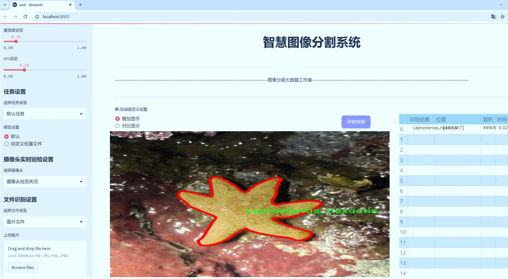
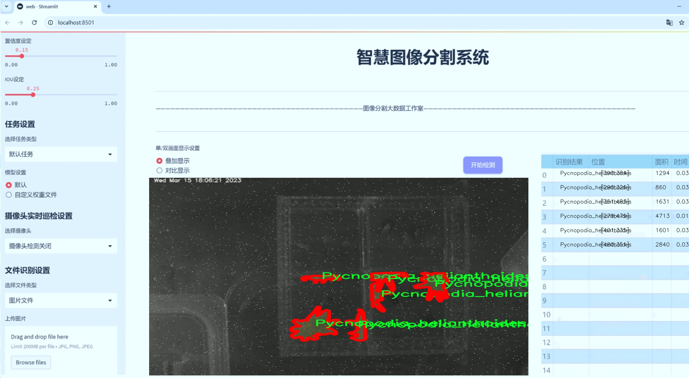
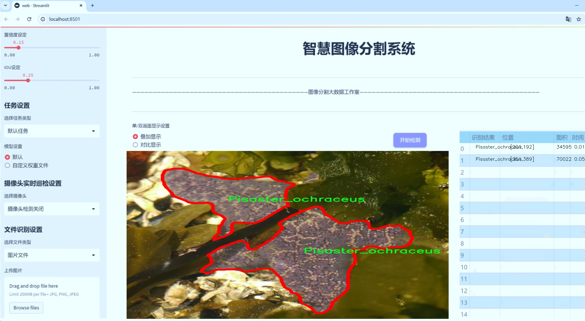
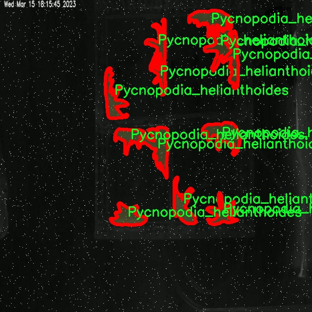
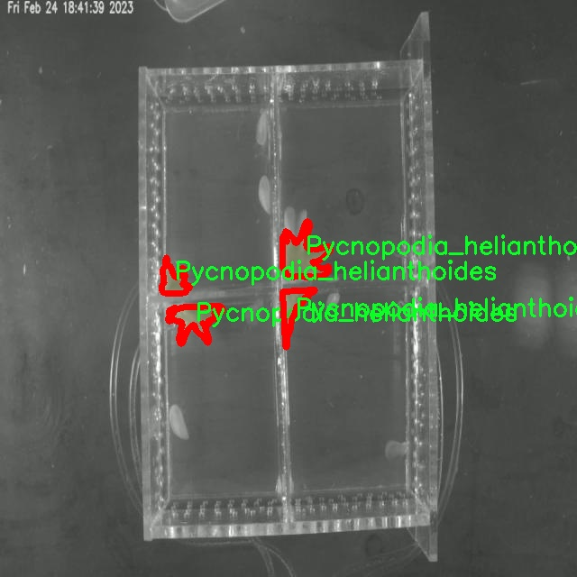
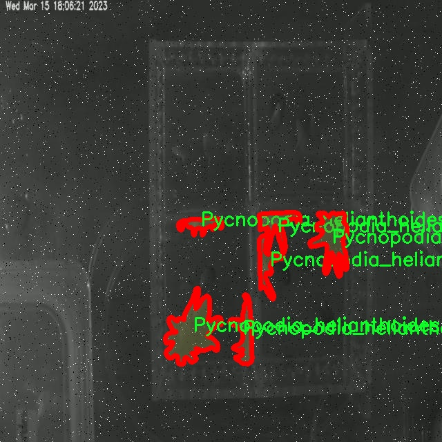
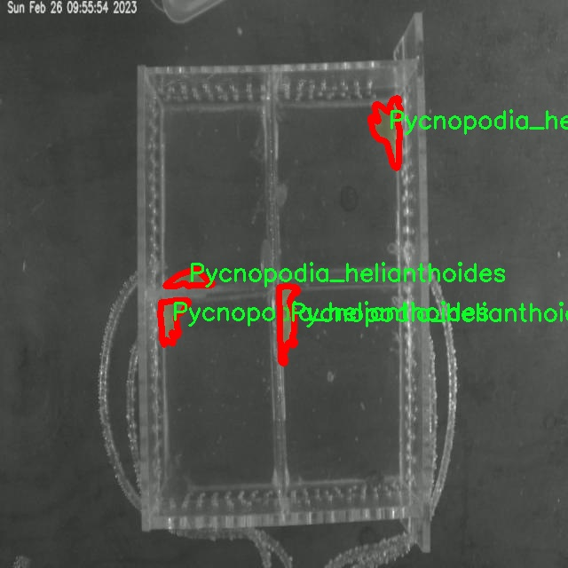

# 海星图像分割系统源码＆数据集分享
 [yolov8-seg-convnextv2＆yolov8-seg-SPDConv等50+全套改进创新点发刊_一键训练教程_Web前端展示]

### 1.研究背景与意义

项目参考[ILSVRC ImageNet Large Scale Visual Recognition Challenge](https://gitee.com/YOLOv8_YOLOv11_Segmentation_Studio/projects)

项目来源[AAAI Global Al lnnovation Contest](https://kdocs.cn/l/cszuIiCKVNis)

研究背景与意义

海星作为一种重要的海洋生物，不仅在生态系统中扮演着关键角色，还因其独特的形态和生物特性而受到广泛关注。随着海洋生态研究的深入，海星的种类、分布及其生态功能逐渐成为海洋生物学研究的热点之一。然而，传统的海星分类和研究方法往往依赖于人工观察和手工标注，这不仅耗时耗力，而且容易受到主观因素的影响，导致数据的准确性和可靠性不足。因此，开发一种高效、准确的海星图像分割系统显得尤为重要。

近年来，深度学习技术的迅猛发展为图像处理领域带来了革命性的变化，尤其是在目标检测和图像分割方面。YOLO（You Only Look Once）系列模型因其高效的实时检测能力而受到广泛应用。YOLOv8作为该系列的最新版本，结合了更为先进的网络结构和算法优化，展现出卓越的性能。然而，针对特定领域的应用，尤其是海洋生物图像的分割，仍然存在许多挑战。例如，海星的种类繁多，形态各异，且在自然环境中常常与其他生物混合，导致图像分割的复杂性增加。因此，基于改进YOLOv8的海星图像分割系统的研究具有重要的理论意义和实际应用价值。

本研究所使用的数据集“StarSeg”包含5300幅海星图像，涵盖28个不同的海星种类。这一丰富的数据集为模型的训练和验证提供了坚实的基础。通过对这些图像进行实例分割，可以有效地提取出不同种类海星的特征信息，从而实现对海星种类的自动识别和分类。这不仅能够提高海星研究的效率，还能为海洋生态监测、物种保护及海洋资源管理提供重要的数据支持。

此外，海星作为生态系统的指示物种，其种群变化能够反映出海洋环境的健康状况。因此，构建一个高效的海星图像分割系统，不仅能够推动海洋生物学的研究进展，还能为海洋生态保护提供科学依据。通过对海星种类的准确识别和分布监测，可以更好地评估海洋生态系统的变化，进而制定相应的保护措施。

综上所述，基于改进YOLOv8的海星图像分割系统的研究，不仅具有重要的学术价值，还能为实际的生态保护和资源管理提供切实可行的解决方案。这一研究将为海洋生物学领域的深度学习应用开辟新的方向，同时也为海洋生态系统的可持续发展贡献力量。

### 2.图片演示







##### 注意：由于此博客编辑较早，上面“2.图片演示”和“3.视频演示”展示的系统图片或者视频可能为老版本，新版本在老版本的基础上升级如下：（实际效果以升级的新版本为准）

  （1）适配了YOLOV8的“目标检测”模型和“实例分割”模型，通过加载相应的权重（.pt）文件即可自适应加载模型。

  （2）支持“图片识别”、“视频识别”、“摄像头实时识别”三种识别模式。

  （3）支持“图片识别”、“视频识别”、“摄像头实时识别”三种识别结果保存导出，解决手动导出（容易卡顿出现爆内存）存在的问题，识别完自动保存结果并导出到tempDir中。

  （4）支持Web前端系统中的标题、背景图等自定义修改，后面提供修改教程。

  另外本项目提供训练的数据集和训练教程,暂不提供权重文件（best.pt）,需要您按照教程进行训练后实现图片演示和Web前端界面演示的效果。

### 3.视频演示

[3.1 视频演示](https://www.bilibili.com/video/BV1g6CmYPEiS/)

### 4.数据集信息展示

##### 4.1 本项目数据集详细数据（类别数＆类别名）

nc: 28
names: ['Ampheraster_marianus', 'Ceramaster_patagonicus', 'Crossaster_papposus', 'Dermasterias_imbricata', 'Evasterias_troschelii', 'Henricia_aspera', 'Henricia_leviuscula', 'Henricia_pumila', 'Henricia_sanguinolenta', 'Hippasteria_phrygiana', 'Leptasterias_hexactis', 'Lophaster_furcilliger', 'Luidia_foliolata', 'Mediaster_aequalis', 'Orthasterias_koehleri', 'Patiria_miniata', 'Pisaster_brevispinus', 'Pisaster_ochraceus', 'Poraniopsis_inflata', 'Pteraster_militaris', 'Pteraster_tesselatus', 'Pycnopodia_helianthoides', 'Rathbunaster_californicus', 'Solaster_dawsoni', 'Solaster_endeca', 'Solaster_stimpsoni', 'Stylasterias_forreri', 'Unknown_species']


##### 4.2 本项目数据集信息介绍

数据集信息展示

在本研究中，我们构建了一个名为“StarSeg”的数据集，旨在改进YOLOv8-seg的海星图像分割系统。该数据集包含28个类别的海星，涵盖了多种海星的种类和特征，为模型的训练提供了丰富的样本和多样化的场景。数据集的设计旨在提升图像分割的准确性和鲁棒性，尤其是在处理复杂背景和不同光照条件下的海星图像时。

“StarSeg”数据集中的类别包括多种海星，每个类别都具有独特的形态特征和生态习性。这些类别包括：Ampheraster marianus、Ceramaster patagonicus、Crossaster papposus、Dermasterias imbricata、Evasterias troschelii、Henricia aspera、Henricia levuiscula、Henricia pumila、Henricia sanguinolenta、Hippasteria phrygiana、Leptasterias hexactis、Lophaster furcilliger、Luidia foliolata、Mediaster aequalis、Orthasterias koehleri、Patiria miniata、Pisaster brevispinus、Pisaster ochraceus、Poraniopsis inflata、Pteraster militaris、Pteraster tesselatus、Pycnopodia helianthoides、Rathbunaster californicus、Solaster dawsoni、Solaster endeca、Solaster stimpsoni、Stylasterias forreri，以及一个“Unknown species”类别，用于标记那些无法明确识别的海星种类。

为了确保数据集的多样性和代表性，我们在不同的海洋环境中收集了这些海星的图像，包括岩石区、沙底和珊瑚礁等生态系统。每个类别的图像都经过精心挑选，确保涵盖了不同的角度、姿态和环境条件。通过这种方式，我们的数据集不仅能够反映出海星的多样性，还能够提高模型在实际应用中的适应能力。

在数据标注方面，我们采用了专业的图像标注工具，对每张图像中的海星进行精确的分割标注。每个类别的海星都被清晰地标识出来，以便于模型在训练过程中能够学习到不同海星的特征和形状。这种细致的标注工作为后续的模型训练提供了坚实的基础，确保了模型能够有效地进行图像分割。

此外，为了增强模型的泛化能力，我们还对数据集进行了数据增强处理，包括旋转、缩放、翻转和颜色调整等。这些增强技术不仅增加了训练样本的数量，还提高了模型对不同场景和条件的适应能力，使其在实际应用中能够更好地应对各种挑战。

综上所述，“StarSeg”数据集的构建不仅为改进YOLOv8-seg的海星图像分割系统提供了丰富的训练数据，还为海洋生物研究和生态保护提供了重要的参考资料。通过对海星图像的深入分析和研究，我们希望能够推动海洋生态学的进一步发展，并为海洋生物的保护与管理提供科学依据。










### 5.全套项目环境部署视频教程（零基础手把手教学）

[5.1 环境部署教程链接（零基础手把手教学）](https://www.bilibili.com/video/BV1jG4Ve4E9t/?vd_source=bc9aec86d164b67a7004b996143742dc)


[5.2 安装Python虚拟环境创建和依赖库安装视频教程链接（零基础手把手教学）](https://www.bilibili.com/video/BV1nA4VeYEze/?vd_source=bc9aec86d164b67a7004b996143742dc)

### 6.手把手YOLOV8-seg训练视频教程（零基础小白有手就能学会）

[6.1 手把手YOLOV8-seg训练视频教程（零基础小白有手就能学会）](https://www.bilibili.com/video/BV1cA4VeYETe/?vd_source=bc9aec86d164b67a7004b996143742dc)


按照上面的训练视频教程链接加载项目提供的数据集，运行train.py即可开始训练



     Epoch   gpu_mem       box       obj       cls    labels  img_size
     1/200     0G   0.01576   0.01955  0.007536        22      1280: 100%|██████████| 849/849 [14:42<00:00,  1.04s/it]
               Class     Images     Labels          P          R     mAP@.5 mAP@.5:.95: 100%|██████████| 213/213 [01:14<00:00,  2.87it/s]
                 all       3395      17314      0.994      0.957      0.0957      0.0843

     Epoch   gpu_mem       box       obj       cls    labels  img_size
     2/200     0G   0.01578   0.01923  0.007006        22      1280: 100%|██████████| 849/849 [14:44<00:00,  1.04s/it]
               Class     Images     Labels          P          R     mAP@.5 mAP@.5:.95: 100%|██████████| 213/213 [01:12<00:00,  2.95it/s]
                 all       3395      17314      0.996      0.956      0.0957      0.0845

     Epoch   gpu_mem       box       obj       cls    labels  img_size
     3/200     0G   0.01561    0.0191  0.006895        27      1280: 100%|██████████| 849/849 [10:56<00:00,  1.29it/s]
               Class     Images     Labels          P          R     mAP@.5 mAP@.5:.95: 100%|███████   | 187/213 [00:52<00:00,  4.04it/s]
                 all       3395      17314      0.996      0.957      0.0957      0.0845


### 7.50+种全套YOLOV8-seg创新点代码加载调参视频教程（一键加载写好的改进模型的配置文件）

[7.1 50+种全套YOLOV8-seg创新点代码加载调参视频教程（一键加载写好的改进模型的配置文件）](https://www.bilibili.com/video/BV1Hw4VePEXv/?vd_source=bc9aec86d164b67a7004b996143742dc)

### 8.YOLOV8-seg图像分割算法原理

原始YOLOv8-seg算法原理

YOLOv8-seg算法是Ultralytics公司在2023年推出的YOLO系列中的最新版本，代表了目标检测和分割技术的前沿进展。该算法在YOLOv7的基础上进行了多项创新和优化，旨在提升目标检测的精度和速度，尤其是在复杂场景下的表现。YOLOv8-seg不仅具备了目标检测的能力，还引入了语义分割的功能，使其在处理图像时能够更细致地识别和分割出不同的目标区域。

YOLOv8-seg的核心在于其高效的网络结构和创新的模块设计。首先，YOLOv8-seg采用了C2f模块替代了YOLOv5中的C3模块。C2f模块通过引入更多的残差连接，能够在保持模型轻量化的同时，获取更丰富的梯度信息。这种设计使得网络在训练过程中能够更有效地传递信息，提升了模型的学习能力和最终的检测精度。此外，YOLOv8-seg的主干网络采用了CSP（Cross Stage Partial）结构，将特征提取过程分为两个部分，分别进行卷积和连接。这种结构的设计不仅增强了特征的表达能力，还提高了计算效率，特别是在处理高分辨率图像时表现尤为突出。

在特征融合方面，YOLOv8-seg引入了PAN-FPN（Path Aggregation Network - Feature Pyramid Network）结构。这一结构通过多尺度特征的融合，能够有效地整合来自不同层次的特征信息，提升了模型对不同大小目标的检测能力。尤其是在复杂背景下，PAN-FPN的特征融合策略能够显著提高目标的可检测性和分割精度。

YOLOv8-seg的检测网络采用了Anchor-Free的检测方式，这一创新使得模型在处理目标时不再依赖于预定义的锚框，从而减少了模型的复杂性并提高了灵活性。通过解耦头结构，YOLOv8-seg将分类和检测任务分离，进一步提升了模型的效率和准确性。分类和回归的损失函数设计上，YOLOv8-seg使用了BCELoss作为分类损失，DFLLoss和CIoULoss作为回归损失，这种组合能够更好地平衡分类和定位的精度。

在数据增强方面，YOLOv8-seg借鉴了YOLOvX中的一些策略，特别是在训练的最后10个epoch中关闭马赛克增强，这一策略能够有效避免过拟合，并提升模型在真实场景中的泛化能力。同时，动态Task-Aligned Assigner样本分配策略的引入，使得模型在训练过程中能够更好地适应不同难度的样本，从而提高了整体的训练效率和效果。

YOLOv8-seg的优势不仅体现在其高效的检测能力上，还在于其广泛的应用场景。该算法能够在智能监控、自动驾驶、医学影像分析等多个领域中发挥重要作用。尤其是在需要实时处理和分析的场景中，YOLOv8-seg凭借其优越的帧率和精度，成为了众多应用的首选。

综上所述，YOLOv8-seg算法通过多项创新设计和优化，提升了目标检测和分割的性能。其独特的网络结构、灵活的检测方式以及高效的数据处理策略，使得YOLOv8-seg在复杂场景下依然能够保持高精度和高速度的表现。这些特性不仅为学术研究提供了新的思路，也为实际应用带来了更大的便利和可能性。随着YOLOv8-seg的不断发展和完善，未来在计算机视觉领域的应用前景将更加广阔。


### 9.系统功能展示（检测对象为举例，实际内容以本项目数据集为准）

图9.1.系统支持检测结果表格显示

  图9.2.系统支持置信度和IOU阈值手动调节

  图9.3.系统支持自定义加载权重文件best.pt(需要你通过步骤5中训练获得)

  图9.4.系统支持摄像头实时识别

  图9.5.系统支持图片识别

  图9.6.系统支持视频识别

  图9.7.系统支持识别结果文件自动保存

  图9.8.系统支持Excel导出检测结果数据


### 10.50+种全套YOLOV8-seg创新点原理讲解（非科班也可以轻松写刊发刊，V11版本正在科研待更新）

#### 10.1 由于篇幅限制，每个创新点的具体原理讲解就不一一展开，具体见下列网址中的创新点对应子项目的技术原理博客网址【Blog】：


[10.1 50+种全套YOLOV8-seg创新点原理讲解链接](https://gitee.com/qunmasj/good)

#### 10.2 部分改进模块原理讲解(完整的改进原理见上图和技术博客链接)【如果此小节的图加载失败可以通过CSDN或者Github搜索该博客的标题访问原始博客，原始博客图片显示正常】

### YOLOv8模型
YOLOv8模型由Ultralytics团队在YOLOv5模型的基础上，吸收了近两年半来经过实际验证的各种改进，于2023年1月提出。与之前的一些YOLO 系列模型想类似，YOLOv8模型也有多种尺寸，下面以YOLOv8n为例，分析 YOLOv8模型的结构和改进点。YOLOv8模型网络结构如
输入图片的部分，由于发现Mosaic数据增强尽管这有助于提升模型的鲁棒性和泛化性，但是，在一定程度上，也会破坏数据的真实分布，使得模型学习到一些不好的信息。所以YOLOv8模型在训练中的最后10个epoch 停止使用Mosaic数据增强。


在网络结构上，首先主干网络的改变不大，主要是将C3模块替换为了C2f模块，该模块的结构在上图中已示出。C2f模块在C3模块的思路基础上，引入了YOLOv7中 ELAN的思路，引入了更多的跳层连接，这有助于该模块获得更丰富的梯度流信息，而且模型的轻量化得到了保证。依然保留了SPPF，效果不变的同时减少了该模块的执行时间。
在颈部网络中，也是将所有的C3模块更改为C2f模块，同时删除了两处上采样之前的卷积连接层。
在头部网络中，采用了YOLOX中使用的解耦头的思路，两条并行的分支分别提取类别和位置特征。由于分类任务更注重于分析特征图中提取到的特征与已输入图片的部分，由于发现 Mosaic数据增强尽管这有助于提升模型的鲁棒性和泛化性，但是，在一定程度上，也会破坏数据的真实分布，使得模型学习到一些不好的信息。所以YOLOv8模型在训练中的最后10个epoch停止使用Mosaic数据增强。
在网络结构上，首先主干网络的改变不大，主要是将C3模块替换为了C2f模块，该模块的结构在上图中已示出。C2f模块在C3模块的思路基础上，引入了YOLOv7中ELAN的思路，引入了更多的跳层连接，这有助于该模块获得更丰富的梯度流信息，而且模型的轻量化得到了保证。依然保留了SPPF，效果不变的同时减少了该模块的执行时间。
在颈部网络中，也是将所有的C3模块更改为C2f模块，同时删除了两处上采样之前的卷积连接层。
在头部网络中，采用了YOLOX中使用的解耦头的思路，两条并行的分支分别提取类别和位置特征。由于分类任务更注重于分析特征图中提取到的特征与已有类别中的哪一种更为相似，而定位任务更关注边界框与真值框的位置关系，并据此对边界框的坐标进行调整。侧重点的不同使得在使用两个检测头时收敛的速度和预测的精度有所提高。而且使用了无锚框结构，直接预测目标的中心，并使用TAL (Task Alignment Learning，任务对齐学习）来区分正负样本，引入了分类分数和IOU的高次幂乘积作为衡量任务对齐程度的指标，认为同时拥有好的定位和分类评价的在分类和定位损失函数中也引入了这项指标。
在模型的检测结果上，YOLOv8模型也取得了较好的成果，图为官方在coCO数据集上 YOLOv8模型的模型尺寸大小和检测的mAP50-95对比图。mAP50-95指的是IOU的值从50%取到95%，步长为5%，然后算在这些IOU下的mAP的均值。图的 a）图展示了YOLOv8在同尺寸下模型中参数没有较大增加的前提下取得了比其他模型更好的精度，图2-17的b)图展示了YOLOv8比其他YOLO系列模型在同尺寸时，推理速度更快且精度没有太大下降。


### 视觉transformer(ViT)简介
视觉transformer(ViT)最近在各种计算机视觉任务中证明了巨大的成功，并受到了相当多的关注。与卷积神经网络(CNNs)相比，ViT具有更强的全局信息捕获能力和远程交互能力，表现出优于CNNs的准确性，特别是在扩大训练数据大小和模型大小时[An image is worth 16x16 words: Transformers for image recognition at scale,Coatnet]。

尽管ViT在低分辨率和高计算领域取得了巨大成功，但在高分辨率和低计算场景下，ViT仍不如cnn。例如，下图(左)比较了COCO数据集上当前基于cnn和基于vit的一级检测器。基于vit的检测器(160G mac)和基于cnn的检测器(6G mac)之间的效率差距超过一个数量级。这阻碍了在边缘设备的实时高分辨率视觉应用程序上部署ViT。


左图:现有的基于vit的一级检测器在实时目标检测方面仍然不如当前基于cnn的一级检测器，需要的计算量多出一个数量级。本文引入了第一个基于vit的实时对象检测器来弥补这一差距。在COCO上，efficientvit的AP比efficientdet高3.8，而mac较低。与YoloX相比，efficient ViT节省67.2%的计算成本，同时提供更高的AP。

中:随着输入分辨率的增加，计算成本呈二次增长，无法有效处理高分辨率的视觉应用。

右图:高分辨率对图像分割很重要。当输入分辨率从1024x2048降低到512x1024时，MobileNetV2的mIoU减少12% (8.5 mIoU)。在不提高分辨率的情况下，只提高模型尺寸是无法缩小性能差距的。

ViT的根本计算瓶颈是softmax注意模块，其计算成本随输入分辨率的增加呈二次增长。例如，如上图(中)所示，随着输入分辨率的增加，vit- small[Pytorch image models. https://github.com/rwightman/ pytorch-image-models]的计算成本迅速显著大于ResNet-152的计算成本。

解决这个问题的一个直接方法是降低输入分辨率。然而，高分辨率的视觉识别在许多现实世界的计算机视觉应用中是必不可少的，如自动驾驶，医疗图像处理等。当输入分辨率降低时，图像中的小物体和精细细节会消失，导致目标检测和语义分割性能显著下降。

上图(右)显示了在cityscape数据集上不同输入分辨率和宽度乘法器下MobileNetV2的性能。例如，将输入分辨率从1024x2048降低到512x1024会使cityscape的性能降低12% (8.5 mIoU)。即使是3.6倍高的mac，只放大模型尺寸而不增加分辨率也无法弥补这一性能损失。

除了降低分辨率外，另一种代表性的方法是限制softmax注意，方法是将其范围限制在固定大小的局部窗口内[Swin transformer,Swin transformer v2]或降低键/值张量的维数[Pyramid vision transformer,Segformer]。然而，它损害了ViT的非局部注意能力，降低了全局接受域(ViT最重要的优点)，使得ViT与大内核cnn的区别更小[A convnet for the 2020s,Scaling up your kernels to 31x31: Revisiting large kernel design in cnns,Lite pose: Efficient architecture design for 2d human pose estimation]。

本文介绍了一个有效的ViT体系结构，以解决这些挑战。发现没有必要坚持softmax注意力。本文建议用线性注意[Transformers are rnns: Fast autoregressive transformers with linear attention]代替softmax注意。

线性注意的关键好处是，它保持了完整的n 2 n^2n 2
 注意映射，就像softmax注意。同时，它利用矩阵乘法的联想特性，避免显式计算完整的注意映射，同时保持相同的功能。因此，它保持了softmax注意力的全局特征提取能力，且计算复杂度仅为线性。线性注意的另一个关键优点是它避免了softmax，这使得它在移动设备上更有效(下图左)。


左图:线性注意比类似mac下的softmax注意快3.3-4.5倍，这是因为去掉了硬件效率不高的softmax功能。延迟是在Qualcomm Snapdragon 855 CPU和TensorFlow-Lite上测量的。本文增加线性注意的头部数量，以确保它具有与softmax注意相似的mac。

中:然而，如果没有softmax注意中使用的非线性注意评分归一化，线性注意无法有效集中其注意分布，削弱了其局部特征提取能力。后文提供了可视化。

右图:本文用深度卷积增强线性注意，以解决线性注意的局限性。深度卷积可以有效地捕捉局部特征，而线性注意可以专注于捕捉全局信息。增强的线性注意在保持线性注意的效率和简单性的同时，表现出在各种视觉任务上的强大表现(图4)。

然而，直接应用线性注意也有缺点。以往的研究表明线性注意和softmax注意之间存在显著的性能差距(下图中间)。


左:高通骁龙855上的精度和延迟权衡。效率vit比效率网快3倍，精度更高。中:ImageNet上softmax注意与线性注意的比较。在相同的计算条件下，本文观察到softmax注意与线性注意之间存在显著的精度差距。而深度卷积增强模型后，线性注意的精度有明显提高。

相比之下，softmax注意的精度变化不大。在相同MAC约束下，增强线性注意比增强软最大注意提高了0.3%的精度。右图:与增强的softmax注意相比，增强的线性注意硬件效率更高，随着分辨率的增加，延迟增长更慢。

深入研究线性注意和softmax注意的详细公式，一个关键的区别是线性注意缺乏非线性注意评分归一化方案。这使得线性注意无法有效地将注意力分布集中在局部模式产生的高注意分数上，从而削弱了其局部特征提取能力。

本文认为这是线性注意的主要限制，使其性能不如softmax注意。本文提出了一个简单而有效的解决方案来解决这一限制，同时保持线性注意在低复杂度和低硬件延迟方面的优势。具体来说，本文建议通过在每个FFN层中插入额外的深度卷积来增强线性注意。因此，本文不需要依赖线性注意进行局部特征提取，避免了线性注意在捕捉局部特征方面的不足，并利用了线性注意在捕捉全局特征方面的优势。

本文广泛评估了efficient vit在低计算预算下对各种视觉任务的有效性，包括COCO对象检测、城市景观语义分割和ImageNet分类。本文想要突出高效的主干设计，所以没有包括任何正交的附加技术(例如，知识蒸馏，神经架构搜索)。尽管如此，在COCO val2017上，efficientvit的AP比efficientdet - d1高2.4倍，同时节省27.9%的计算成本。在cityscape上，efficientvit提供了比SegFormer高2.5个mIoU，同时降低了69.6%的计算成本。在ImageNet上，efficientvit在584M mac上实现了79.7%的top1精度，优于efficientnet - b1的精度，同时节省了16.6%的计算成本。

与现有的以减少参数大小或mac为目标的移动ViT模型[Mobile-former,Mobilevit,NASVit]不同，本文的目标是减少移动设备上的延迟。本文的模型不涉及复杂的依赖或硬件低效操作。因此，本文减少的计算成本可以很容易地转化为移动设备上的延迟减少。

在高通骁龙855 CPU上，efficient vit运行速度比efficientnet快3倍，同时提供更高的ImageNet精度。本文的代码和预训练的模型将在出版后向公众发布。

### Efficient Vision Transformer.
提高ViT的效率对于在资源受限的边缘平台上部署ViT至关重要，如手机、物联网设备等。尽管ViT在高计算区域提供了令人印象深刻的性能，但在针对低计算区域时，它通常不如以前高效的cnn[Efficientnet, mobilenetv3,Once for all: Train one network and specialize it for efficient deployment]。为了缩小差距，MobileViT建议结合CNN和ViT的长处，使用transformer将卷积中的局部处理替换为全局处理。MobileFormer提出了在MobileNet和Transformer之间建立双向桥以实现特征融合的并行化。NASViT提出利用神经架构搜索来搜索高效的ViT架构。

这些模型在ImageNet上提供了极具竞争力的准确性和效率的权衡。然而，它们并不适合高分辨率的视觉任务，因为它们仍然依赖于softmax注意力。


在本节中，本文首先回顾了自然语言处理中的线性注意，并讨论了它的优缺点。接下来，本文介绍了一个简单而有效的解决方案来克服线性注意的局限性。最后，给出了efficient vit的详细架构。

 为可学习投影矩阵。Oi表示矩阵O的第i行。Sim(·，·)为相似度函数。

虽然softmax注意力在视觉和NLP方面非常成功，但它并不是唯一的选择。例如，线性注意提出了如下相似度函数:


其中，φ(·)为核函数。在本工作中，本文选择了ReLU作为内核函数，因为它对硬件来说是友好的。当Sim(Q, K) = φ(Q)φ(K)T时，式(1)可改写为:


线性注意的一个关键优点是，它允许利用矩阵乘法的结合律，在不改变功能的情况下，将计算复杂度从二次型降低到线性型:


除了线性复杂度之外，线性注意的另一个关键优点是它不涉及注意模块中的softmax。Softmax在硬件上效率非常低。避免它可以显著减少延迟。例如，下图(左)显示了softmax注意和线性注意之间的延迟比较。在类似的mac上，线性注意力比移动设备上的softmax注意力要快得多。


#### EfficientViT
Enhancing Linear Attention with Depthwise Convolution

虽然线性注意在计算复杂度和硬件延迟方面优于softmax注意，但线性注意也有局限性。以往的研究[\[Luna: Linear unified nested attention,Random feature attention,Combiner: Full attention transformer with sparse computation cost,cosformer: Rethinking softmax in attention\]](https://afdian.net/item/602b9612927111ee9ec55254001e7c00)表明，在NLP中线性注意和softmax注意之间通常存在显著的性能差距。对于视觉任务，之前的研究[Visual correspondence hallucination,Quadtree attention for vision transformers]也表明线性注意不如softmax注意。在本文的实验中，本文也有类似的观察结果(图中)。


本文对这一假设提出了质疑，认为线性注意的低劣性能主要是由于局部特征提取能力的丧失。如果没有在softmax注意中使用的非线性评分归一化，线性注意很难像softmax注意那样集中其注意分布。下图(中间)提供了这种差异的示例。


在相同的原始注意力得分下，使用softmax比不使用softmax更能集中注意力。因此，线性注意不能有效地聚焦于局部模式产生的高注意分数(下图)，削弱了其局部特征提取能力。


注意图的可视化显示了线性注意的局限性。通过非线性注意归一化，softmax注意可以产生清晰的注意分布，如中间行所示。相比之下，线性注意的分布相对平滑，使得线性注意在捕捉局部细节方面的能力较弱，造成了显著的精度损失。本文通过深度卷积增强线性注意来解决这一限制，并有效提高了准确性。

介绍了一个简单而有效的解决方案来解决这个限制。本文的想法是用卷积增强线性注意，这在局部特征提取中是非常有效的。这样，本文就不需要依赖于线性注意来捕捉局部特征，而可以专注于全局特征提取。具体来说，为了保持线性注意的效率和简单性，本文建议在每个FFN层中插入一个深度卷积，这样计算开销很小，同时极大地提高了线性注意的局部特征提取能力。

#### Building Block

下图(右)展示了增强线性注意的详细架构，它包括一个线性注意层和一个FFN层，在FFN的中间插入深度卷积。


与之前的方法[Swin transformer,Coatnet]不同，本文在efficientvit中没有使用相对位置偏差。相对位置偏差虽然可以改善模型的性能，但它使模型容易受到分辨率变化[Segformer]的影响。多分辨率训练或新分辨率下的测试在检测和分割中很常见。去除相对位置偏差使高效率vit对输入分辨率更加灵活。

与之前低计算CNNs[Mobilenetv2,mobilenetv3]的设计不同，本文为下采样块添加了额外的下采样快捷方式。每个下采样快捷方式由一个平均池和一个1x1卷积组成。在本文的实验中，这些额外的下采样快捷方式可以稳定训练效率，提高性能。

#### Macro Architecture

下图说明了efficientvit的宏观体系结构。它由输入 stem 和4级组成。最近的研究[Coatnet,Levit,Early convolutions help transformers see better]表明在早期阶段使用卷积对ViT更好。本文遵循这个设计，在第三阶段开始使用增强的线性注意。


EfficientViT宏观架构。本文从第三阶段开始使用增强的线性注意。P2、P3和P4形成了一个金字塔特征图，用于检测和分割。P4用于分类。

为了突出高效的主干本身，本文对MBConv和FFN使用相同的扩展比e (e = 4)保持超参数简单，对所有深度卷积使用相同的内核大小k(除了输入stem)，对所有层使用相同的激活函数(hard swish)。

P2、P3和P4表示阶段2、3和4的输出，形成了特征图的金字塔。本文按照惯例将P2、P3和P4送至检测头。本文使用Yolov8进行检测。为了分割，本文融合了P2和P4。融合特征被馈送到一个轻量级头，包括几个卷积层，遵循Fast-SCNN。为了分类，本文将P4输入到轻量级头部，与MobileNetV3相同。


### 11.项目核心源码讲解（再也不用担心看不懂代码逻辑）

#### 11.1 ui.py

以下是经过精简和注释的核心代码：

```python
import sys
import subprocess
from QtFusion.path import abs_path

def run_script(script_path):
    """
    使用当前 Python 环境运行指定的脚本。

    Args:
        script_path (str): 要运行的脚本路径
    """
    # 获取当前 Python 解释器的路径
    python_path = sys.executable

    # 构建运行命令，使用 streamlit 运行指定的脚本
    command = f'"{python_path}" -m streamlit run "{script_path}"'

    # 执行命令并捕获结果
    result = subprocess.run(command, shell=True)
    
    # 检查命令执行是否成功
    if result.returncode != 0:
        print("脚本运行出错。")

# 主程序入口
if __name__ == "__main__":
    # 获取脚本的绝对路径
    script_path = abs_path("web.py")

    # 运行指定的脚本
    run_script(script_path)
```

### 代码注释说明：

1. **导入模块**：
   - `sys`：用于访问与 Python 解释器紧密相关的变量和函数。
   - `subprocess`：用于创建新进程、连接到它们的输入/输出/错误管道，并获取返回码。
   - `abs_path`：从 `QtFusion.path` 模块导入的函数，用于获取文件的绝对路径。

2. **`run_script` 函数**：
   - 接受一个参数 `script_path`，表示要运行的 Python 脚本的路径。
   - 使用 `sys.executable` 获取当前 Python 解释器的路径，以确保使用相同的环境运行脚本。
   - 构建命令字符串，使用 `streamlit` 模块运行指定的脚本。
   - 使用 `subprocess.run` 执行命令，并检查返回码以确定脚本是否成功运行。

3. **主程序入口**：
   - 通过 `if __name__ == "__main__":` 确保代码仅在直接运行时执行。
   - 使用 `abs_path` 获取 `web.py` 的绝对路径。
   - 调用 `run_script` 函数运行指定的脚本。

这个文件是一个 Python 脚本，主要功能是通过当前的 Python 环境运行一个指定的脚本。首先，文件导入了必要的模块，包括 `sys`、`os` 和 `subprocess`，以及一个自定义的模块 `QtFusion.path` 中的 `abs_path` 函数。

在 `run_script` 函数中，首先获取当前 Python 解释器的路径，存储在 `python_path` 变量中。接着，构建一个命令字符串，该命令使用 `streamlit` 运行指定的脚本。这里的 `script_path` 参数是传入的脚本路径，命令格式为 `"{python_path}" -m streamlit run "{script_path}"`。

然后，使用 `subprocess.run` 方法执行这个命令，`shell=True` 表示在一个新的 shell 中执行命令。执行完命令后，检查返回的结果，如果返回码不为 0，表示脚本运行出错，此时会打印出错误信息。

在文件的最后部分，使用 `if __name__ == "__main__":` 来判断是否是直接运行该脚本。如果是，则指定要运行的脚本路径，这里使用 `abs_path("web.py")` 来获取 `web.py` 的绝对路径。最后，调用 `run_script` 函数来执行这个脚本。

整体来看，这个文件的作用是为运行一个 Streamlit 应用提供了一个简单的入口，通过指定脚本路径来启动应用。

#### 11.2 ultralytics\utils\triton.py

以下是代码中最核心的部分，并附上详细的中文注释：

```python
from typing import List
from urllib.parse import urlsplit
import numpy as np

class TritonRemoteModel:
    """
    与远程Triton推理服务器模型交互的客户端。

    属性:
        endpoint (str): Triton服务器上模型的名称。
        url (str): Triton服务器的URL。
        triton_client: Triton客户端（HTTP或gRPC）。
        InferInput: Triton客户端的输入类。
        InferRequestedOutput: Triton客户端的输出请求类。
        input_formats (List[str]): 模型输入的数据类型。
        np_input_formats (List[type]): 模型输入的numpy数据类型。
        input_names (List[str]): 模型输入的名称。
        output_names (List[str]): 模型输出的名称。
    """

    def __init__(self, url: str, endpoint: str = '', scheme: str = ''):
        """
        初始化TritonRemoteModel。

        参数可以单独提供，也可以从形式为
            <scheme>://<netloc>/<endpoint>/<task_name>的集合'url'参数中解析。

        参数:
            url (str): Triton服务器的URL。
            endpoint (str): Triton服务器上模型的名称。
            scheme (str): 通信方案（'http'或'gRPC'）。
        """
        if not endpoint and not scheme:  # 从URL字符串解析所有参数
            splits = urlsplit(url)
            endpoint = splits.path.strip('/').split('/')[0]  # 提取模型名称
            scheme = splits.scheme  # 提取通信方案
            url = splits.netloc  # 提取服务器地址

        self.endpoint = endpoint  # 设置模型名称
        self.url = url  # 设置服务器URL

        # 根据通信方案选择Triton客户端
        if scheme == 'http':
            import tritonclient.http as client  # 导入HTTP客户端
            self.triton_client = client.InferenceServerClient(url=self.url, verbose=False, ssl=False)
            config = self.triton_client.get_model_config(endpoint)  # 获取模型配置
        else:
            import tritonclient.grpc as client  # 导入gRPC客户端
            self.triton_client = client.InferenceServerClient(url=self.url, verbose=False, ssl=False)
            config = self.triton_client.get_model_config(endpoint, as_json=True)['config']  # 获取模型配置

        # 按字母顺序排序输出名称，例如 'output0', 'output1' 等
        config['output'] = sorted(config['output'], key=lambda x: x.get('name'))

        # 定义模型属性
        type_map = {'TYPE_FP32': np.float32, 'TYPE_FP16': np.float16, 'TYPE_UINT8': np.uint8}  # 数据类型映射
        self.InferRequestedOutput = client.InferRequestedOutput  # 设置输出请求类
        self.InferInput = client.InferInput  # 设置输入类
        self.input_formats = [x['data_type'] for x in config['input']]  # 获取输入数据类型
        self.np_input_formats = [type_map[x] for x in self.input_formats]  # 获取numpy数据类型
        self.input_names = [x['name'] for x in config['input']]  # 获取输入名称
        self.output_names = [x['name'] for x in config['output']]  # 获取输出名称

    def __call__(self, *inputs: np.ndarray) -> List[np.ndarray]:
        """
        使用给定的输入调用模型。

        参数:
            *inputs (List[np.ndarray]): 模型的输入数据。

        返回:
            List[np.ndarray]: 模型的输出。
        """
        infer_inputs = []  # 初始化输入列表
        input_format = inputs[0].dtype  # 获取输入数据的类型
        for i, x in enumerate(inputs):
            # 如果输入数据类型与模型期望的类型不匹配，则进行类型转换
            if x.dtype != self.np_input_formats[i]:
                x = x.astype(self.np_input_formats[i])
            # 创建InferInput对象并设置数据
            infer_input = self.InferInput(self.input_names[i], [*x.shape], self.input_formats[i].replace('TYPE_', ''))
            infer_input.set_data_from_numpy(x)  # 从numpy数组设置数据
            infer_inputs.append(infer_input)  # 添加到输入列表

        # 创建输出请求对象
        infer_outputs = [self.InferRequestedOutput(output_name) for output_name in self.output_names]
        # 调用Triton客户端进行推理
        outputs = self.triton_client.infer(model_name=self.endpoint, inputs=infer_inputs, outputs=infer_outputs)

        # 返回输出结果，转换为原始输入数据类型
        return [outputs.as_numpy(output_name).astype(input_format) for output_name in self.output_names]
```

### 代码核心部分说明：
1. **类定义**：`TritonRemoteModel`类用于与远程Triton推理服务器进行交互。
2. **初始化方法**：`__init__`方法用于初始化类的实例，解析URL并设置模型的相关属性。
3. **调用方法**：`__call__`方法允许使用输入数据调用模型并返回输出结果，处理输入数据类型并与Triton客户端进行交互。

这个程序文件定义了一个名为 `TritonRemoteModel` 的类，用于与远程的 Triton 推理服务器模型进行交互。该类的主要功能是通过 HTTP 或 gRPC 协议与 Triton 服务器进行通信，发送输入数据并接收模型的输出结果。

在类的初始化方法 `__init__` 中，用户可以通过提供 URL、模型名称和通信协议来设置 Triton 服务器的连接。如果没有提供模型名称和协议，程序会从 URL 中解析这些信息。URL 的格式为 `<scheme>://<netloc>/<endpoint>/<task_name>`，其中 `scheme` 是通信协议（如 http 或 grpc），`netloc` 是服务器地址，`endpoint` 是模型名称。

根据提供的通信协议，程序会导入相应的 Triton 客户端库，并创建一个 Triton 客户端实例。随后，它会获取指定模型的配置，并对输出名称进行排序。模型的输入和输出信息被提取并存储在类的属性中，包括输入的名称、数据类型等。

类的 `__call__` 方法允许用户以函数的方式调用模型。用户可以传入一个或多个 NumPy 数组作为输入数据。该方法会检查输入数据的类型，并根据模型的要求进行必要的类型转换。然后，它会创建输入对象并将数据设置到这些对象中。接着，程序会创建输出请求对象，并通过 Triton 客户端的 `infer` 方法发送推理请求。

最后，方法返回的结果是一个包含模型输出的 NumPy 数组列表，输出数据的类型会被转换为与输入数据相同的格式。这使得用户能够方便地使用 Triton 服务器进行模型推理，并获取结果。

#### 11.3 demo_test_video.py

以下是经过简化和注释的核心代码部分：

```python
import cv2
import numpy as np
from PIL import ImageFont, ImageDraw, Image
from hashlib import md5
from model import Web_Detector
from chinese_name_list import Label_list

def generate_color_based_on_name(name):
    # 使用MD5哈希函数生成基于名称的稳定颜色
    hash_object = md5(name.encode())
    hex_color = hash_object.hexdigest()[:6]  # 取前6位16进制数
    r, g, b = int(hex_color[0:2], 16), int(hex_color[2:4], 16), int(hex_color[4:6], 16)
    return (b, g, r)  # OpenCV使用BGR格式

def draw_with_chinese(image, text, position, font_size=20, color=(255, 0, 0)):
    # 在图像上绘制中文文本
    image_pil = Image.fromarray(cv2.cvtColor(image, cv2.COLOR_BGR2RGB))  # 转换为PIL格式
    draw = ImageDraw.Draw(image_pil)  # 创建绘图对象
    font = ImageFont.truetype("simsun.ttc", font_size, encoding="unic")  # 加载中文字体
    draw.text(position, text, font=font, fill=color)  # 绘制文本
    return cv2.cvtColor(np.array(image_pil), cv2.COLOR_RGB2BGR)  # 转换回OpenCV格式

def draw_detections(image, info):
    # 在图像上绘制检测结果
    name, bbox = info['class_name'], info['bbox']  # 获取类别名称和边界框
    x1, y1, x2, y2 = bbox  # 解包边界框坐标
    cv2.rectangle(image, (x1, y1), (x2, y2), color=(0, 0, 255), thickness=3)  # 绘制边界框
    image = draw_with_chinese(image, name, (x1, y1 - 10), font_size=20)  # 绘制类别名称
    return image

def process_frame(model, image):
    # 处理每一帧图像
    pre_img = model.preprocess(image)  # 预处理图像
    pred = model.predict(pre_img)  # 进行预测
    det = pred[0]  # 获取检测结果

    if det is not None and len(det):
        det_info = model.postprocess(pred)  # 后处理得到检测信息
        for info in det_info:
            image = draw_detections(image, info)  # 绘制检测结果
    return image

if __name__ == "__main__":
    model = Web_Detector()  # 创建模型实例
    model.load_model("./weights/yolov8s-seg.pt")  # 加载模型权重

    # 视频处理
    video_path = ''  # 输入视频路径
    cap = cv2.VideoCapture(video_path)  # 打开视频文件
    while cap.isOpened():
        ret, frame = cap.read()  # 逐帧读取视频
        if not ret:
            break
        processed_frame = process_frame(model, frame)  # 处理当前帧
        cv2.imshow('Processed Video', processed_frame)  # 显示处理后的视频
        if cv2.waitKey(1) & 0xFF == ord('q'):
            break  # 按'q'键退出
    cap.release()  # 释放视频捕获对象
    cv2.destroyAllWindows()  # 关闭所有OpenCV窗口
```

### 代码注释说明：
1. **生成颜色**：通过对名称进行MD5哈希，生成一个稳定的颜色值，确保同一名称每次生成的颜色一致。
2. **绘制中文文本**：使用PIL库在图像上绘制中文文本，确保文本能够正确显示。
3. **绘制检测结果**：在图像上绘制检测到的对象的边界框和类别名称。
4. **处理每一帧**：对视频中的每一帧进行预处理、预测和后处理，绘制检测结果。
5. **视频处理循环**：打开视频文件，逐帧读取并处理，显示处理后的视频，直到用户按下'q'键退出。

这个程序文件 `demo_test_video.py` 是一个用于视频处理的脚本，主要功能是利用深度学习模型进行目标检测和分割，并在视频帧上绘制检测结果。以下是对代码的详细说明。

首先，程序导入了一些必要的库，包括 `random`、`cv2`（OpenCV）、`numpy`、`PIL`（用于处理图像的库）、`hashlib`（用于生成哈希值）、以及自定义的 `Web_Detector` 模型和 `Label_list`。这些库提供了图像处理、数值计算和深度学习模型的支持。

接下来，定义了几个辅助函数。`generate_color_based_on_name(name)` 函数使用 MD5 哈希函数根据输入的名称生成一个稳定的颜色值，返回值为 BGR 格式的颜色元组。`calculate_polygon_area(points)` 函数计算给定点集的多边形面积，使用 OpenCV 的 `contourArea` 方法。

`draw_with_chinese(image, text, position, font_size=20, color=(255, 0, 0))` 函数负责在图像上绘制中文文本。它使用 PIL 库将 OpenCV 图像转换为 PIL 图像，设置字体和颜色，然后将文本绘制到指定位置。

`adjust_parameter(image_size, base_size=1000)` 函数根据图像的大小调整参数，以便在不同分辨率下保持绘制效果的一致性。`draw_detections(image, info, alpha=0.2)` 函数则是核心绘制函数，它根据检测到的信息（如类别名称、边界框、置信度、类别 ID 和掩码）在图像上绘制检测结果。如果存在掩码，它会计算多边形的面积、周长和圆度，并随机选择一些点来计算颜色值，然后将这些信息绘制到图像上。

`process_frame(model, image)` 函数负责处理每一帧图像。它首先对图像进行预处理，然后通过模型进行预测，最后将检测到的目标绘制到图像上。

在 `__main__` 部分，程序首先加载标签列表和深度学习模型，并从指定路径加载模型权重。然后，它打开视频文件并逐帧读取视频内容。在每一帧中，调用 `process_frame` 函数进行处理，并使用 OpenCV 显示处理后的帧。如果用户按下 'q' 键，程序将退出。

总体来说，这个程序实现了从视频中读取帧，利用深度学习模型进行目标检测，并在图像上绘制检测结果和相关信息的功能。

#### 11.4 ultralytics\models\yolo\detect\__init__.py

以下是经过简化并添加详细中文注释的核心代码部分：

```python
# 导入必要的模块
from .predict import DetectionPredictor  # 导入目标检测预测器
from .train import DetectionTrainer      # 导入目标检测训练器
from .val import DetectionValidator      # 导入目标检测验证器

# 定义模块的公开接口，只有这些类可以被外部访问
__all__ = 'DetectionPredictor', 'DetectionTrainer', 'DetectionValidator'
```

### 代码详细注释：

1. **导入模块**：
   - `from .predict import DetectionPredictor`：从当前包的 `predict` 模块中导入 `DetectionPredictor` 类，该类负责处理目标检测的预测任务。
   - `from .train import DetectionTrainer`：从当前包的 `train` 模块中导入 `DetectionTrainer` 类，该类用于训练目标检测模型。
   - `from .val import DetectionValidator`：从当前包的 `val` 模块中导入 `DetectionValidator` 类，该类用于验证训练好的目标检测模型的性能。

2. **定义公开接口**：
   - `__all__ = 'DetectionPredictor', 'DetectionTrainer', 'DetectionValidator'`：这个特殊变量 `__all__` 用于定义模块的公共接口，只有在 `from module import *` 语句中列出的类会被导入。这意味着用户在使用这个模块时，只能访问 `DetectionPredictor`、`DetectionTrainer` 和 `DetectionValidator` 这三个类。

这个程序文件是Ultralytics YOLO模型的一部分，主要用于目标检测。文件名为`__init__.py`，通常用于标识一个目录为Python包，并且可以在包被导入时执行一些初始化代码。

在这个文件中，首先有一个注释，指出这是Ultralytics YOLO的代码，并且提到它遵循AGPL-3.0许可证。这意味着该代码是开源的，用户可以自由使用和修改，但需要遵循相应的许可证条款。

接下来，文件通过相对导入的方式引入了三个类：`DetectionPredictor`、`DetectionTrainer`和`DetectionValidator`。这些类分别负责目标检测的不同功能。`DetectionPredictor`用于进行目标检测的预测，`DetectionTrainer`用于训练模型，而`DetectionValidator`则用于验证模型的性能。

最后，`__all__`变量被定义为一个元组，包含了上述三个类的名称。这一做法的目的是为了控制从这个包中导入的内容。当用户使用`from ultralytics.models.yolo.detect import *`这样的语句时，只有在`__all__`中列出的类会被导入，从而避免不必要的名称污染。

总体来说，这个文件的主要作用是组织和管理YOLO目标检测相关的功能模块，使得其他代码能够方便地导入和使用这些功能。

#### 11.5 ultralytics\engine\results.py

以下是代码中最核心的部分，并附上详细的中文注释：

```python
class BaseTensor(SimpleClass):
    """基础张量类，提供额外的方法以便于操作和设备管理。"""

    def __init__(self, data, orig_shape) -> None:
        """
        初始化BaseTensor，包含数据和原始形状。

        参数:
            data (torch.Tensor | np.ndarray): 预测结果，例如边界框、掩码和关键点。
            orig_shape (tuple): 图像的原始形状。
        """
        assert isinstance(data, (torch.Tensor, np.ndarray))  # 确保数据是张量或numpy数组
        self.data = data  # 存储数据
        self.orig_shape = orig_shape  # 存储原始形状

    @property
    def shape(self):
        """返回数据张量的形状。"""
        return self.data.shape

    def cpu(self):
        """返回一个在CPU内存上的张量副本。"""
        return self if isinstance(self.data, np.ndarray) else self.__class__(self.data.cpu(), self.orig_shape)

    def numpy(self):
        """返回一个作为numpy数组的张量副本。"""
        return self if isinstance(self.data, np.ndarray) else self.__class__(self.data.numpy(), self.orig_shape)

    def cuda(self):
        """返回一个在GPU内存上的张量副本。"""
        return self.__class__(torch.as_tensor(self.data).cuda(), self.orig_shape)

    def to(self, *args, **kwargs):
        """返回一个具有指定设备和数据类型的张量副本。"""
        return self.__class__(torch.as_tensor(self.data).to(*args, **kwargs), self.orig_shape)

    def __len__(self):  # 重写len(results)
        """返回数据张量的长度。"""
        return len(self.data)

    def __getitem__(self, idx):
        """返回具有指定索引的数据张量的BaseTensor副本。"""
        return self.__class__(self.data[idx], self.orig_shape)


class Results(SimpleClass):
    """
    存储和操作推理结果的类。

    参数:
        orig_img (numpy.ndarray): 原始图像的numpy数组。
        path (str): 图像文件的路径。
        names (dict): 类名的字典。
        boxes (torch.tensor, optional): 每个检测的边界框坐标的2D张量。
        masks (torch.tensor, optional): 检测掩码的3D张量，每个掩码是一个二进制图像。
        probs (torch.tensor, optional): 每个类的概率的1D张量。
        keypoints (List[List[float]], optional): 每个对象的检测关键点的列表。

    属性:
        orig_img (numpy.ndarray): 原始图像的numpy数组。
        orig_shape (tuple): 原始图像的形状。
        boxes (Boxes, optional): 包含检测边界框的Boxes对象。
        masks (Masks, optional): 包含检测掩码的Masks对象。
        probs (Probs, optional): 包含每个类概率的Probs对象。
        keypoints (Keypoints, optional): 包含每个对象检测关键点的Keypoints对象。
    """

    def __init__(self, orig_img, path, names, boxes=None, masks=None, probs=None, keypoints=None) -> None:
        """初始化Results类。"""
        self.orig_img = orig_img  # 存储原始图像
        self.orig_shape = orig_img.shape[:2]  # 存储原始图像的形状
        self.boxes = Boxes(boxes, self.orig_shape) if boxes is not None else None  # 存储边界框
        self.masks = Masks(masks, self.orig_shape) if masks is not None else None  # 存储掩码
        self.probs = Probs(probs) if probs is not None else None  # 存储概率
        self.keypoints = Keypoints(keypoints, self.orig_shape) if keypoints is not None else None  # 存储关键点
        self.names = names  # 存储类名
        self.path = path  # 存储图像路径

    def update(self, boxes=None, masks=None, probs=None):
        """更新Results对象的边界框、掩码和概率属性。"""
        if boxes is not None:
            ops.clip_boxes(boxes, self.orig_shape)  # 裁剪边界框
            self.boxes = Boxes(boxes, self.orig_shape)
        if masks is not None:
            self.masks = Masks(masks, self.orig_shape)
        if probs is not None:
            self.probs = probs

    def plot(self, conf=True, boxes=True, masks=True, probs=True):
        """
        在输入RGB图像上绘制检测结果。

        参数:
            conf (bool): 是否绘制检测置信度分数。
            boxes (bool): 是否绘制边界框。
            masks (bool): 是否绘制掩码。
            probs (bool): 是否绘制分类概率。

        返回:
            (numpy.ndarray): 注释图像的numpy数组。
        """
        # 省略其他参数处理和绘制逻辑
        pass  # 这里可以实现绘制逻辑

    def save_txt(self, txt_file, save_conf=False):
        """
        将预测结果保存到txt文件中。

        参数:
            txt_file (str): txt文件路径。
            save_conf (bool): 是否保存置信度分数。
        """
        # 省略保存逻辑
        pass  # 这里可以实现保存逻辑
```

### 代码核心部分说明
1. **BaseTensor类**：这是一个基础类，提供了对张量的基本操作，包括在不同设备（CPU/GPU）之间的转换，以及获取张量的形状和长度等功能。

2. **Results类**：这个类用于存储推理结果，包括原始图像、边界框、掩码、概率和关键点等信息。它提供了更新结果和绘制检测结果的方法。

3. **更新和绘制方法**：`update`方法用于更新检测结果，`plot`方法用于在图像上绘制检测结果。

4. **保存结果**：`save_txt`方法用于将检测结果保存到文本文件中。

这些类和方法为处理YOLO模型的推理结果提供了结构化的方式，便于后续的分析和可视化。

这个程序文件是Ultralytics YOLO模型的一部分，主要用于处理推理结果，包括检测框、掩码和关键点等。文件中定义了多个类，分别用于管理和操作这些推理结果，以下是对代码的详细说明。

首先，文件导入了一些必要的库，包括深度学习框架PyTorch和NumPy，以及一些用于数据处理和可视化的工具。接着，定义了一个基类`BaseTensor`，该类扩展了基本的张量操作，提供了对数据的设备管理和形状获取等功能。它支持将数据从GPU转移到CPU，或转换为NumPy数组等。

接下来是`Results`类，它用于存储和操作推理结果。这个类的构造函数接收原始图像、文件路径、类别名称、检测框、掩码、概率和关键点等参数，并将这些信息存储为类的属性。`Results`类还提供了一些方法，例如更新检测框和掩码、将结果转换为不同的设备、绘制检测结果、保存结果到文本文件或JSON格式等。

`Boxes`、`Masks`、`Keypoints`和`Probs`类分别用于处理检测框、掩码、关键点和分类概率。这些类继承自`BaseTensor`，并提供了特定于各自数据类型的属性和方法。例如，`Boxes`类提供了获取检测框坐标、置信度和类别等信息的方法，而`Masks`类则用于处理分割掩码。

在`Results`类中，`plot`方法用于在输入图像上绘制检测结果。该方法支持绘制检测框、掩码、关键点和分类概率等信息，并允许用户自定义绘图参数，如线宽、字体大小和颜色等。`verbose`方法用于生成每个任务的日志字符串，方便用户查看检测结果的详细信息。

此外，`save_txt`和`save_crop`方法用于将检测结果保存到文本文件或图像文件中。`tojson`方法则将检测结果转换为JSON格式，便于与其他系统进行数据交互。

总体来说，这个文件提供了一套完整的接口和工具，用于处理YOLO模型的推理结果，支持多种数据格式的转换和可视化，方便用户进行后续分析和应用。

#### 11.6 train.py

以下是经过简化并注释的核心代码部分：

```python
import os
import torch
import yaml
from ultralytics import YOLO  # 导入YOLO模型

if __name__ == '__main__':  # 确保该模块被直接运行时才执行以下代码
    # 设置训练参数
    workers = 1  # 数据加载的工作进程数
    batch = 8  # 每个批次的样本数量
    device = "0" if torch.cuda.is_available() else "cpu"  # 检查是否有可用的GPU

    # 获取数据集配置文件的绝对路径
    data_path = abs_path(f'datasets/data/data.yaml', path_type='current')

    # 读取YAML文件，保持原有顺序
    with open(data_path, 'r') as file:
        data = yaml.load(file, Loader=yaml.FullLoader)

    # 修改数据集中训练、验证和测试集的路径
    if 'train' in data and 'val' in data and 'test' in data:
        directory_path = os.path.dirname(data_path.replace(os.sep, '/'))  # 获取目录路径
        data['train'] = directory_path + '/train'  # 更新训练集路径
        data['val'] = directory_path + '/val'      # 更新验证集路径
        data['test'] = directory_path + '/test'    # 更新测试集路径

        # 将修改后的数据写回YAML文件
        with open(data_path, 'w') as file:
            yaml.safe_dump(data, file, sort_keys=False)

    # 加载YOLO模型
    model = YOLO(r"C:\codeseg\codenew\50+种YOLOv8算法改进源码大全和调试加载训练教程（非必要）\改进YOLOv8模型配置文件\yolov8-seg-C2f-Faster.yaml").load("./weights/yolov8s-seg.pt")

    # 开始训练模型
    results = model.train(
        data=data_path,  # 指定训练数据的配置文件路径
        device=device,  # 指定使用的设备
        workers=workers,  # 指定数据加载的工作进程数
        imgsz=640,  # 输入图像的大小
        epochs=100,  # 训练的轮数
        batch=batch,  # 每个批次的样本数量
    )
```

### 代码注释说明：
1. **导入必要的库**：引入`os`、`torch`、`yaml`和`YOLO`模型库。
2. **主程序入口**：使用`if __name__ == '__main__':`确保代码仅在直接运行时执行。
3. **设置训练参数**：
   - `workers`：设置数据加载的工作进程数。
   - `batch`：设置每个批次的样本数量。
   - `device`：根据是否有可用的GPU选择设备。
4. **读取数据集配置文件**：使用`yaml`库读取YAML格式的数据集配置文件。
5. **更新数据集路径**：根据配置文件中的`train`、`val`和`test`字段更新数据集路径。
6. **加载YOLO模型**：使用指定的配置文件和权重文件加载YOLO模型。
7. **训练模型**：调用`model.train()`方法开始训练，传入训练数据路径、设备、工作进程数、图像大小、训练轮数和批次大小等参数。


#### 11.6 ultralytics\__init__.py

以下是保留的核心代码部分，并附上详细的中文注释：

```python
# Ultralytics YOLO 🚀, AGPL-3.0 license

# 定义当前版本号
__version__ = '8.0.202'

# 从ultralytics.models模块导入多个模型类
from ultralytics.models import RTDETR, SAM, YOLO
from ultralytics.models.fastsam import FastSAM  # 导入FastSAM模型
from ultralytics.models.nas import NAS  # 导入NAS模型

# 导入设置和检查工具
from ultralytics.utils import SETTINGS as settings  # 导入设置
from ultralytics.utils.checks import check_yolo as checks  # 导入YOLO检查工具
from ultralytics.utils.downloads import download  # 导入下载工具

# 定义模块的公共接口，允许外部访问这些组件
__all__ = '__version__', 'YOLO', 'NAS', 'SAM', 'FastSAM', 'RTDETR', 'checks', 'download', 'settings'
```

### 注释说明：
1. **版本号**：`__version__` 用于标识当前代码的版本，方便用户和开发者进行版本管理。
2. **模型导入**：从 `ultralytics.models` 中导入了多种模型，包括 YOLO、RTDETR、SAM 和 NAS，这些模型用于目标检测和图像分割等任务。
3. **工具导入**：
   - `SETTINGS`：包含模型和训练的配置设置。
   - `check_yolo`：用于检查YOLO模型的有效性和兼容性。
   - `download`：提供下载功能，可能用于下载模型权重或数据集。
4. **公共接口**：`__all__` 定义了模块的公共接口，指定了哪些变量和类可以被外部导入，这有助于封装和管理模块的使用。

这个程序文件是Ultralytics库的初始化文件，文件名为`__init__.py`，它的主要作用是定义该模块的版本信息，并导入其他模块和功能，使得在使用该库时能够方便地访问这些功能。

首先，文件开头有一个注释，标明这是Ultralytics YOLO的代码，并且使用了AGPL-3.0许可证。接着，定义了一个版本号`__version__`，表示当前库的版本为'8.0.202'。

随后，文件从`ultralytics.models`模块中导入了多个模型，包括`RTDETR`、`SAM`和`YOLO`，这些都是与目标检测相关的模型。此外，还从`ultralytics.models.fastsam`导入了`FastSAM`，从`ultralytics.models.nas`导入了`NAS`，这些模型可能具有不同的特性和应用场景。

在工具函数方面，文件从`ultralytics.utils`模块导入了`SETTINGS`，用于配置和设置库的参数。同时，从`ultralytics.utils.checks`导入了`check_yolo`，这个函数可能用于检查YOLO模型的状态或配置。最后，从`ultralytics.utils.downloads`导入了`download`函数，用于下载所需的资源或模型。

文件的最后一行定义了`__all__`，这是一个特殊的变量，用于指定当使用`from ultralytics import *`时，哪些名称会被导入。这里列出了版本号、各个模型类、检查函数、下载函数和设置，这样可以确保用户在使用这个库时能够方便地访问这些功能。

总体来说，这个文件是Ultralytics库的核心部分，负责模块的初始化和功能的导入，使得用户可以方便地使用各种目标检测模型和相关工具。

### 12.系统整体结构（节选）

### 程序整体功能和构架概括

该程序是一个基于YOLO（You Only Look Once）目标检测框架的实现，旨在提供一个完整的目标检测解决方案。它包括模型训练、推理、结果处理和可视化等功能。程序的架构由多个模块组成，每个模块负责特定的功能，使得整个系统结构清晰、可维护性高。

- **模型训练**：提供训练YOLO模型的功能。
- **推理与检测**：实现图像或视频流中的目标检测。
- **结果处理**：处理检测结果，包括绘制检测框、保存结果等。
- **数据增强**：对输入数据进行增强，以提高模型的泛化能力。
- **工具和实用程序**：提供一些辅助功能，如基准测试、数据转换等。

### 文件功能整理表

| 文件路径                                   | 功能描述                                                                 |
|--------------------------------------------|--------------------------------------------------------------------------|
| `ui.py`                                    | 提供Streamlit界面以便于用户交互和展示目标检测结果。                    |
| `ultralytics/utils/triton.py`             | 封装Triton推理服务的客户端，提供模型推理接口。                          |
| `demo_test_video.py`                       | 从视频中读取帧并进行目标检测，绘制检测结果并显示。                      |
| `ultralytics/models/yolo/detect/__init__.py` | 定义YOLO目标检测相关的类和方法，组织检测功能模块。                      |
| `ultralytics/engine/results.py`           | 处理YOLO模型推理结果，支持结果可视化和保存。                           |
| `train.py`                                 | 训练YOLO模型的主入口，包含训练流程和参数设置。                         |
| `ultralytics/__init__.py`                 | 初始化Ultralytics包，定义可导入的模块和类。                             |
| `ultralytics/data/augment.py`             | 实现数据增强功能，提供多种数据增强方法以提高模型的鲁棒性。             |
| `ultralytics/models/yolo/classify/train.py` | 训练YOLO分类模型的功能，支持分类任务。                                 |
| `ultralytics/trackers/utils/kalman_filter.py` | 实现卡尔曼滤波器，用于目标跟踪的状态估计。                             |
| `ultralytics/models/nas/__init__.py`      | 定义神经架构搜索（NAS）相关的类和方法，组织NAS功能模块。                |
| `ultralytics/data/converter.py`           | 数据转换工具，支持不同数据格式之间的转换。                             |
| `ultralytics/utils/benchmarks.py`         | 提供基准测试工具，用于评估模型性能和推理速度。                          |

这个表格总结了各个文件的主要功能，便于理解整个程序的结构和各个模块之间的关系。

注意：由于此博客编辑较早，上面“11.项目核心源码讲解（再也不用担心看不懂代码逻辑）”中部分代码可能会优化升级，仅供参考学习，完整“训练源码”、“Web前端界面”和“50+种创新点源码”以“14.完整训练+Web前端界面+50+种创新点源码、数据集获取”的内容为准。

### 13.图片、视频、摄像头图像分割Demo(去除WebUI)代码

在这个博客小节中，我们将讨论如何在不使用WebUI的情况下，实现图像分割模型的使用。本项目代码已经优化整合，方便用户将分割功能嵌入自己的项目中。
核心功能包括图片、视频、摄像头图像的分割，ROI区域的轮廓提取、类别分类、周长计算、面积计算、圆度计算以及颜色提取等。
这些功能提供了良好的二次开发基础。

### 核心代码解读

以下是主要代码片段，我们会为每一块代码进行详细的批注解释：

```python
import random
import cv2
import numpy as np
from PIL import ImageFont, ImageDraw, Image
from hashlib import md5
from model import Web_Detector
from chinese_name_list import Label_list

# 根据名称生成颜色
def generate_color_based_on_name(name):
    ......

# 计算多边形面积
def calculate_polygon_area(points):
    return cv2.contourArea(points.astype(np.float32))

...
# 绘制中文标签
def draw_with_chinese(image, text, position, font_size=20, color=(255, 0, 0)):
    image_pil = Image.fromarray(cv2.cvtColor(image, cv2.COLOR_BGR2RGB))
    draw = ImageDraw.Draw(image_pil)
    font = ImageFont.truetype("simsun.ttc", font_size, encoding="unic")
    draw.text(position, text, font=font, fill=color)
    return cv2.cvtColor(np.array(image_pil), cv2.COLOR_RGB2BGR)

# 动态调整参数
def adjust_parameter(image_size, base_size=1000):
    max_size = max(image_size)
    return max_size / base_size

# 绘制检测结果
def draw_detections(image, info, alpha=0.2):
    name, bbox, conf, cls_id, mask = info['class_name'], info['bbox'], info['score'], info['class_id'], info['mask']
    adjust_param = adjust_parameter(image.shape[:2])
    spacing = int(20 * adjust_param)

    if mask is None:
        x1, y1, x2, y2 = bbox
        aim_frame_area = (x2 - x1) * (y2 - y1)
        cv2.rectangle(image, (x1, y1), (x2, y2), color=(0, 0, 255), thickness=int(3 * adjust_param))
        image = draw_with_chinese(image, name, (x1, y1 - int(30 * adjust_param)), font_size=int(35 * adjust_param))
        y_offset = int(50 * adjust_param)  # 类别名称上方绘制，其下方留出空间
    else:
        mask_points = np.concatenate(mask)
        aim_frame_area = calculate_polygon_area(mask_points)
        mask_color = generate_color_based_on_name(name)
        try:
            overlay = image.copy()
            cv2.fillPoly(overlay, [mask_points.astype(np.int32)], mask_color)
            image = cv2.addWeighted(overlay, 0.3, image, 0.7, 0)
            cv2.drawContours(image, [mask_points.astype(np.int32)], -1, (0, 0, 255), thickness=int(8 * adjust_param))

            # 计算面积、周长、圆度
            area = cv2.contourArea(mask_points.astype(np.int32))
            perimeter = cv2.arcLength(mask_points.astype(np.int32), True)
            ......

            # 计算色彩
            mask = np.zeros(image.shape[:2], dtype=np.uint8)
            cv2.drawContours(mask, [mask_points.astype(np.int32)], -1, 255, -1)
            color_points = cv2.findNonZero(mask)
            ......

            # 绘制类别名称
            x, y = np.min(mask_points, axis=0).astype(int)
            image = draw_with_chinese(image, name, (x, y - int(30 * adjust_param)), font_size=int(35 * adjust_param))
            y_offset = int(50 * adjust_param)

            # 绘制面积、周长、圆度和色彩值
            metrics = [("Area", area), ("Perimeter", perimeter), ("Circularity", circularity), ("Color", color_str)]
            for idx, (metric_name, metric_value) in enumerate(metrics):
                ......

    return image, aim_frame_area

# 处理每帧图像
def process_frame(model, image):
    pre_img = model.preprocess(image)
    pred = model.predict(pre_img)
    det = pred[0] if det is not None and len(det)
    if det:
        det_info = model.postprocess(pred)
        for info in det_info:
            image, _ = draw_detections(image, info)
    return image

if __name__ == "__main__":
    cls_name = Label_list
    model = Web_Detector()
    model.load_model("./weights/yolov8s-seg.pt")

    # 摄像头实时处理
    cap = cv2.VideoCapture(0)
    while cap.isOpened():
        ret, frame = cap.read()
        if not ret:
            break
        ......

    # 图片处理
    image_path = './icon/OIP.jpg'
    image = cv2.imread(image_path)
    if image is not None:
        processed_image = process_frame(model, image)
        ......

    # 视频处理
    video_path = ''  # 输入视频的路径
    cap = cv2.VideoCapture(video_path)
    while cap.isOpened():
        ret, frame = cap.read()
        ......
```


### 14.完整训练+Web前端界面+50+种创新点源码、数据集获取


# [下载链接：https://mbd.pub/o/bread/Zp2ZlJ5x](https://mbd.pub/o/bread/Zp2ZlJ5x)